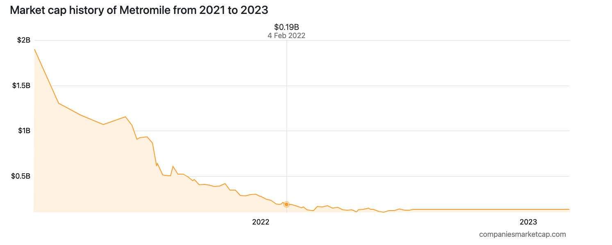
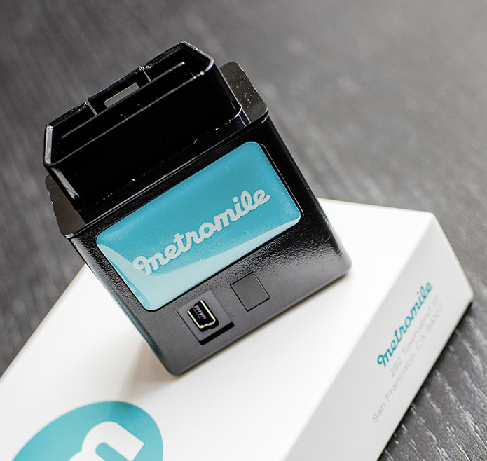
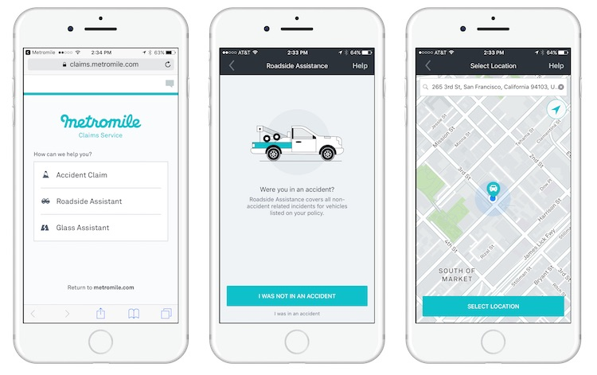

<h1  align="center"> Case study: Metromile </h1> 

  
Table of Contents

  <ol>
    <li>
      <a href="#Overview-and-Origin">Overview and Origin</a>
    </li>
    <li>
      <a href="#Business-Activities">Business Activities</a>
    </li>
    <li>
      <a href="#Landscape">Landscape</a>
    </li>
    <li>
      <a href="#Results">Results</a>
    </li>
    <li>
      <a href="#Recommendations">Recommendations</a>
    </li>
    <li>
      <a href="#Reference">Reference</a>
    </li>
  </ol>

# Overview and Origin

&nbsp;&nbsp;&nbsp;&nbsp; In 2011, Metromile was founded in California by David Friedberg and Steve Pretre, 
to provide a new kind of car insurance that would be fairer, more affordable, and more flexible than traditional policies. 
Metromile offers pricing primarily based on mileage, with lower rates for those who drive infrequently. 

&nbsp;&nbsp;&nbsp;&nbsp; The idea for Metromile came about when Friedberg and Pretre realized that many people in cities 
like San Francisco were driving less and relying more on alternative transportation options like biking, walking, and public transit. 
They recognized that traditional car insurance policies charged a flat rate, regardless of how much people actually drove, 
which meant that people who drove less were effectively subsidizing those who drove more. 

&nbsp;&nbsp;&nbsp;&nbsp; To address this issue, Friedberg and Pretre came up with the idea of offering car insurance 
that was priced based on how much people actually drove. They believed this would be a more fair and more affordable option for people who didn't use 
their cars as much while still providing the same level of coverage as traditional insurance policies. 

&nbsp;&nbsp;&nbsp;&nbsp; In September 2016, they announced a new round of $192 million in funding and acquired a carrier, 
enabling them to start underwriting their policies. The company became publicly listed in February 2021 in a reverse merger deal, supported by Betsy Z. Cohen, who also joined the company’s board of directors. 
On 28 July 2022, Lemonade, Inc. fully acquired Metromile in an all-stock transaction with a fully diluted equity value of approximately $500 million, or around $200 million net of cash. Following the acquisition, 
Lemonade laid off 20% of Metromile's staff. 

# Business Activities 

&nbsp;&nbsp;&nbsp;&nbsp; Traditional auto insurance is unfair to drivers who drive infrequently. Metromile exclusively sells pay-per-mile car 
insurance policies. The company estimates that people who drive fewer than 10,000 miles per year can save hundreds of 
dollars annually. In addition to offering car insurance, the company also provides various tools and services to help drivers
better understand their car usage and manage their expenses. 

## Intended Customers

&nbsp;&nbsp;&nbsp;&nbsp; Metromile’s intended customers are those who don’t drive much and don’t mind having 
their driving tracked. Their pay-per-mile policies are best for drivers who have low monthly mileage, work from home, or 
have another vehicle that is rarely in use. 
However, for people who drive longer distances regularly, Metromile perhaps is not a good option. 

## Market Size

&nbsp;&nbsp;&nbsp;&nbsp; As of February 2023, Metromile has a market capitalization of $0.13 billion. 

&nbsp;&nbsp;&nbsp;&nbsp; According to Metromile's latest financial reports, the company's current revenue is $0.10 billion. 

&nbsp;&nbsp;&nbsp;&nbsp; According to Metromile's latest financial reports the company's current earnings are -$0.22 billion. 

## Solutions Offered 

&nbsp;&nbsp;&nbsp;&nbsp; Traditional auto insurance sets rates based on driving history, age, location and credit history, while Metromile offers a different solution. 

- Metromile aims to connect more drivers with affordable car insurance options with tailor-made solutions, providing a pay-per-mile insurance service that only charges customers for the amount they drive. 

- The Metromile Pulse device tracks drivers’ mileage. The free device plugs into the car's diagnostic port and transmits data to the insurer. Despite the mileage, average speed, cornering, braking etc., can also be collected.

- The app of Metromile includes a series of features to simplify car ownership, such as street-sweeping alerts, a car health monitor, and a location feature which can recover stolen vehicles. This app is currently available for both Apple iOS and Google Android phones.

  - The company’s software platform provides capabilities like mileage and fuel tracking to help customers stay on top of their energy usage and to simplify the auto insurance system.
  
  - Customers can file a claim in the app or online. A guide through each step of the process can facilitate the claim.
 
 

## Technologies used

- **Big data and cloud computing**: The device plugs into the diagnostic port of each client’s car and transmits data to the insurer. This is streaming data with high volume, variety, high velocity and high value. Metromile uses cloud computing to store and process large amounts of data. The company's cloud-based infrastructure allows it to scale quickly and efficiently and to provide real-time data analysis to its customers. 

- **Data analytics**: Metromile uses data analytics to analyze customer behaviour and identify trends in the insurance industry. The company's data science team uses machine learning algorithms to develop predictive models that can help identify risky drivers and prevent fraud.

- **Application development**: Metromile offers a mobile app that allows customers to track their mileage, check their billing, and get help with roadside assistance. The app also includes features such as trip optimization, which can help customers find the cheapest gas stations along their routes.

# Landscape

&nbsp;&nbsp;&nbsp;&nbsp; Currently, Metromile offers only personal car insurance.

## What have been the significant trends and innovations in this domain over the last 5–10 years?

- Real-time insurance
-	As uncertainty declines, pricing becomes fairer and more equitable.
-	As the world is digitized, insurance operations are automated.
-	The digitization of the world allows us to understand the physical world in detail and develop products that align incentives for insurers and consumers. It can tailor plan options to what each customer needs.
-	Removing using the credit score to set rates for car and home insurance 

## What are the other major companies in this domain?

-	Zipari
-	Next Insurance
-	Haven Life
-	Vorvus insurance
-	Kin
-	Policygenius
-	Clearcover
-	Lemonade
-	States title
-	OSCAR health

# Results

&nbsp;&nbsp;&nbsp;&nbsp; Metromile expanded to several states across the United States, including Washington, California, Oregon, Illinois, Arizona, Virginia, Pennsylvania, and New Jersey. 

## Business Impact

&nbsp;&nbsp;&nbsp;&nbsp; Metromile has had a significant impact on the car insurance industry and the way people think about car insurance. Metromile has embraced technology and data analytics to provide personalized insurance products and services to its customers. The company uses telematics devices to track how much people drive and provide usage-based insurance. It also offers a mobile app that allows customers to track their mileage, check their billing, and get help with roadside assistance.

## Performance

&nbsp;&nbsp;&nbsp;&nbsp; Insurance technology companies (insurtechs) like Metromile use a variety of metrics to measure success, some of which include: 

-	Customer acquisition cost (CAC): This measure how much it costs to acquire each new customer. Insurtechs typically aim to keep their CAC low to ensure profitability.
-	Customer lifetime value (CLV): This measure how much revenue a company can expect to generate from a single customer over the course of their relationship. Insurtechs aim to increase CLV by offering additional products and services to their customers.
-	Loss ratio: This measures the claims paid out to premiums earned. Insurtech aims to keep its loss ratio low to ensure profitability.
-	Retention rate: This measures the percentage of customers who renew their policies. Insurtech aims to keep its retention rate high by providing excellent customer service and competitive rates.

&nbsp;&nbsp;&nbsp;&nbsp; Based on publicly available information, Metromile has reported strong performance on several metrics. For example, the company has reported a lower CAC than traditional insurance companies. It has also reported high retention rates, with many customers staying with the company for several years. 

# Recommendations

&nbsp;&nbsp;&nbsp;&nbsp; If I were to advise the Metromile, I would suggest the following:
-	Form a better relationship with the customer
-	Combining a pay-per-mile policy with some traditional policies gives users more flexibility to choose and design their own insurance plans on the app.

## Why would this benefit the company?

&nbsp;&nbsp;&nbsp;&nbsp;According to NerdWallet’s report, in 2018-2020, Metromile had more than the expected number of complaints about auto insurance to state regulators relative to its size, according to three years’ worth of data from the National Association of Insurance Commissioners. 

&nbsp;&nbsp;&nbsp;&nbsp; In addition, Metromile’s market capitalization sharply decreased after the pandemic. One reason is that demand for car travel is increasing as the epidemic ends, and more people drive more than 10,000 miles per year. According to SIMPLY WALL’s report, Metromile is currently unprofitable and not forecast to become profitable over the next 3 years. Over the past 3 months, Metromile has had a volatile share price. 

&nbsp;&nbsp;&nbsp;&nbsp; Moreover, some drivers may prefer not to be monitored by the company. 

## What technologies would be utilized? Why?

-	A Robo-advising system based on AI to provide more personalized options for customers.
-	A more powerful application platform to deal with customers' questions and complaints. Lifelike conversational AI tools can be used to communicate with customs more efficiently.

# Reference
[https://www.metromile.com/](https://www.metromile.com/)

[https://en.wikipedia.org/wiki/Metromile](https://en.wikipedia.org/wiki/Metromile)

[https://www.youtube.com/watch?v=lZbQROnbW8I](https://www.youtube.com/watch?v=lZbQROnbW8I)

[https://www.nerdwallet.com/article/insurance/auto-insurance-reviews](https://www.nerdwallet.com/article/insurance/auto-insurance-reviews)

[https://www.nerdwallet.com/reviews/insurance/metromile](https://www.nerdwallet.com/reviews/insurance/metromile)

[https://simplywall.st/stocks/us/insurance/nasdaq-mile/metromile](https://simplywall.st/stocks/us/insurance/nasdaq-mile/metromile)

[https://companiesmarketcap.com/metromile/marketcap/](https://companiesmarketcap.com/metromile/marketcap/)
